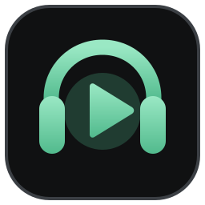

<div align="center">
  
  <h1>Music Desk</h1>
  <p>YouTube 영상과 재생목록을 PC 화면과 Discord 음성 채널에서 함께 재생하는 Windows 앱</p>

  
  
  
</div>

Music Desk는 YouTube 영상을 앱 안에서 보면서 Discord 음성 채널에도 음악을 보내는 Electron 데스크톱 앱입니다. PC와 Discord 음량을 따로 조절하고, 같은 음성방 참가자가 `/영상추가 url` 명령으로 곡을 추가할 수 있습니다.

## 프로그램 화면

<p align="center">
  
</p>

## 다운로드

[최신 릴리스](https://github.com/Aenco5523/discord-music-desk/releases/latest)에서 `Music-Desk-0.1.0-Portable.exe`를 받으세요. 설치 없이 실행할 수 있고, 다른 폴더로 옮겨도 EXE 한 파일로 실행됩니다. 현재 Windows x64용이며 코드 서명은 없습니다.

## 처음 사용하기

1. Discord 봇을 만들고 앱의 **설정**에서 봇 토큰을 저장한 뒤 연결합니다. 토큰은 Windows 암호화 저장소를 통해 로컬에 보관합니다.
2. 봇을 Discord 서버에 초대합니다. 초대 링크에는 `bot`과 `applications.commands` 범위가 필요하며, 음성 채널의 보기·연결·말하기 권한도 필요합니다.
3. 메인 화면에 **음성 채널 ID**를 입력하고 **입장**을 누릅니다.
4. YouTube 영상 또는 재생목록 URL을 추가합니다. 재생목록의 영상은 순서대로 대기열에 들어갑니다. 같은 음성방의 참가자는 Discord에서 `/영상추가 url`로 추가할 수 있습니다.

## 재생 기능

- 앱 화면에 영상과 재생목록이 표시됩니다. 재생·일시정지·이전 곡·다음 곡·탐색 바로 재생 위치를 조절할 수 있습니다.
- PC와 Discord 음량은 독립적입니다. PC만 음소거해도 Discord 출력은 유지됩니다.
- 영상마다 평균 음량을 분석해 -16 LUFS와 -1.5 dBTP를 목표로 평준화합니다. PC와 Discord가 같은 처리 파일을 사용하지만, 모든 순간의 소리가 완전히 같아지는 방식은 아닙니다.
- 최초 재생에는 다운로드와 오디오 처리가 필요합니다. 이후에는 로컬 캐시를 사용합니다.

## 지원 범위

- 공개 일반 영상만 지원합니다. 실시간·비공개·접근 제한 영상은 재생할 수 없습니다.
- 영상은 2시간 이하, 처리된 파일은 1GB 이하입니다. 대기열은 최대 200곡이며, 제한을 넘는 재생목록은 부분 추가 없이 오류를 표시합니다.
- 기본 창은 1320×860, 최소 창 크기는 1000×700입니다. 긴 재생목록과 펼친 설정 도움말은 해당 영역에서 스크롤합니다.
- Discord 음성 송출은 실제 봇 토큰과 서버·채널 권한이 필요합니다. 자동 검증은 로컬 플레이어와 모의 Discord 서비스까지만 수행했습니다.

## 개인정보

봇 토큰과 설정은 사용자의 PC에 보관하고, 재생한 미디어는 로컬 캐시에 저장됩니다. 영상 정보 조회·다운로드에는 YouTube, 봇 연결·명령·음성 송출에는 Discord 네트워크를 사용합니다.

## 소스에서 빌드

Windows x64, Node 22.12 이상과 pnpm 11이 필요합니다. 이 저장소는 소스와 도구의 라이선스 자료를 추적하며, EXE와 `vendor/*.exe`는 Git에서 제외합니다.

`vendor/yt-dlp.exe`는 [공식 2026.08.19 릴리스](https://github.com/yt-dlp/yt-dlp/releases/tag/2026.08.19)의 Windows 실행 파일을 사용하세요. 이 빌드에서 사용한 SHA-256은 `66674953fe251b89f4d08c5f0e35e0728679bd67ab3d7d05c0562af101dd3e7a`입니다. `vendor/ffmpeg.exe`는 로컬 SDK의 `C:\.dev\ffmpeg\bin\ffmpeg.exe`를 복사할 수 있습니다. 이 빌드의 SHA-256은 `864758bf8ea314fc33ce457016bf24d4ebd9af245e98d8691bd1474af9d22c4b`입니다. PowerShell의 `Get-FileHash vendor\파일명.exe -Algorithm SHA256`으로 확인하세요. 다른 FFmpeg 빌드를 사용할 경우 그 출처와 라이선스를 확인하세요.

```powershell
pnpm install
pnpm check
pnpm typecheck
pnpm test
pnpm build
pnpm start
pnpm package:win
node scripts/qa-player.cjs "release/portable/win-unpacked/Music Desk.exe"
```

포터블 EXE는 `release/portable/Music-Desk-0.1.0-Portable.exe`에 생성됩니다. QA 스크립트는 공개 YouTube 영상과 인터넷 연결이 필요하며 실제 Discord 음성 송출은 검증하지 않습니다.

## 서드파티 도구

yt-dlp와 FFmpeg의 버전·출처·라이선스 안내는 [vendor/PROVENANCE.md](vendor/PROVENANCE.md)를 참고하세요. 포함된 라이선스 전문은 `vendor`의 `*-LICENSE.txt` 파일에 있습니다.
