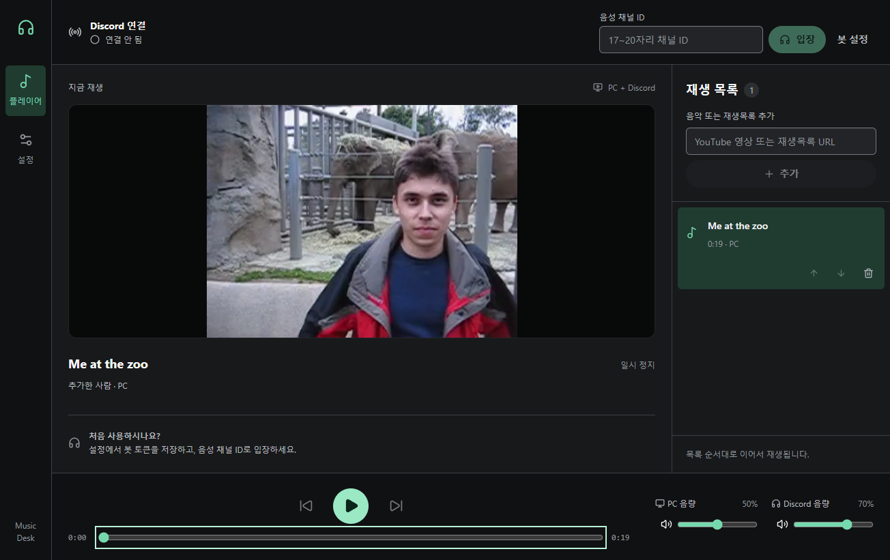

# Music Desk

[한국어](../README.md) · 简体中文 · [日本語](README.ja.md) · [English](README.en.md)

Music Desk 是一款 Windows 应用，可在应用内播放 YouTube 视频和播放列表，并将音频发送到 Discord 语音频道。视频播放器、进度控制、播放队列以及电脑与 Discord 的独立音量控制都在主界面中。同一语音频道的成员可以用 `/영상추가 url` 命令添加视频；简体中文 Discord 客户端会显示 `/添加视频`。



## 下载

从[最新版本](https://github.com/Aenco5523/discord-music-desk/releases/latest)选择一个 Windows x64 文件：`Music-Desk-0.2.0-Setup.exe` 是包含韩语、简体中文、日语和英语的统一安装程序；`Music-Desk-0.2.0-Portable.exe` 无需安装。两个文件均未进行代码签名。

## 开始使用

1. 创建 Discord 机器人，在**设置**中保存令牌并连接。令牌通过 Windows 加密功能保存在本机。
2. 使用 `bot` 和 `applications.commands` 范围邀请机器人，并授予查看、连接及在语音频道发言的权限。
3. 在主界面输入**语音频道 ID**并加入。
4. 添加 YouTube 视频或播放列表 URL。播放列表中的视频会按顺序进入队列。
5. 在**设置 → 语言**中更改应用语言。安装版首次启动使用安装时选择的语言，此后优先使用应用内保存的设置。

## 播放与更新

播放器支持播放、暂停、上一首、下一首和进度跳转。电脑与 Discord 的音量相互独立。应用按视频分析平均响度，以 -16 LUFS 和 -1.5 dBTP 为目标进行标准化，但不会让每一瞬间的音量完全相同。首次播放需要下载和处理，之后会使用本地缓存。

在**设置 → yt-dlp 更新**中可以手动检查官方稳定版。验证成功的更新会用于后续下载；失败时继续使用原有可执行文件。

支持时长不超过两小时的公开普通视频。处理后的文件不超过 1 GB，队列最多 200 首。不支持直播、私有或访问受限的视频。超出限制的播放列表会整体拒绝添加。

## 从源码构建

需要 Windows x64、Node 22.12 或更高版本及 pnpm 11。按照[工具来源说明](../vendor/PROVENANCE.md)准备 `vendor/yt-dlp.exe` 和 `vendor/ffmpeg.exe`；Git 仓库不包含这两个可执行文件。构建安装程序还需要 Inno Setup 6 的 `ISCC.exe`；如果无法自动检测，请设置 `INNO_SETUP_ISCC`。

```powershell
pnpm install
pnpm check
pnpm typecheck
pnpm test
pnpm package:win
pnpm package:installer
```

安装文件输出到 `release/installer`，便携版输出到 `release/portable`。验证实际 Discord 语音发送需要自己的机器人凭据及频道权限。

## 隐私与许可

机器人令牌、设置和媒体缓存保存在本机。应用会访问 YouTube 获取信息和下载视频，并连接 Discord 以运行机器人、命令和语音功能。Music Desk 源代码采用 [MIT 许可](../LICENSE)。随附的 yt-dlp、FFmpeg、Electron 和 Inno Setup 相关组件适用各自的许可。

对应版本的 FFmpeg 核心源码包含在发布附件 `FFmpeg-44d082edc8-source.zip` 中。
